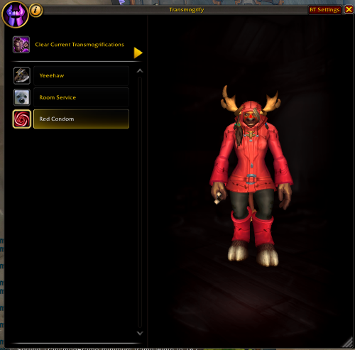
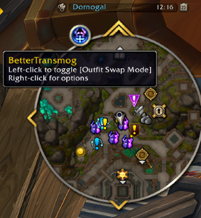
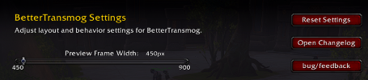

# Version 2.0.4
Quite a major update containing many requested features and improvements! As usual, thank you for your feedback and support and bug reports, if you have any, don't hesitate to open a issue on the github page!

## Added outfit swapping mode
Added outfit swapping mode with expandible outfit prieview that you can open anywhere, anytime to change in between of, or look at - your saved outfits! 

You can access it with the new minimap button, or by using `/bt outfits`
Special thanks to: Smashbru, No-Geologist3092 and Bodehn for requesting this freature!

## Added BetterTransmog Minimap button
Added a better transmog minimap button that lets:
- \[Left-Click\] Open Outfit swapping panel 
- \[Right-Click\] Open BetterTransmog Settings Panel

## Added new /slashcommands and massively improved the /slashcommand system 
The new /slashcommand system supports aliasing, so you can write the same command in different ways. For example, you can use either `/bettertransmog` or `/bt`
Here are the new /slashcommands:
- `/bt` or `/bt settings | options` (opens settings panel)
- `/bt outfits | outfit | fits` (Opens the outfit swapping panel)
- `/bt changelog | changes` (Opens the changelog panel)
- `/bt help` (shows a list of the available commands)

a "|" means "OR", so for example `/bt settings` and `/bt options` both are the same command. 

## Improved frame position + size saving & restoring
The transmog frame has 2 modes now.
- Outfit swap 
- Regular
Positions and sizes for these 2 modes are saved and restored seperately for your convenience!

## Improved changelog frame and system

Made the changelog frame more user-friendly with better readability and smoother interactions, so you can enjoy reading about updates without any hassle!

## Added new buttons in the settings

The bug/feedback button allows for copying a URL to the github issues page, which is the preferred place to give me feedback!

## Codebase upgrades
I won't bore you with the technical stuff, but under the hood, things are changing and improving! and if you are interested, you can always have a peek at the GitHub repo <3

# Version 2.0.3

## Fixed a bug causing a lua error in the Resizing Module
Yep, gotta make sure we keep it clean and lua error free! 07

# Version 2.0.2

## Upgraded Module System
Implemented a new module system supporting dependencies and submodules and slashcommands for better code organization and maintainability.

## Added ChangeLog Module
Introduced a new ChangeLog module that displays version updates to users upon addon load.|r

## Added a /rl command. |r
Added a shorthand way to /reload the ui with /rl (Request by F0ki & Jimbo) |r

